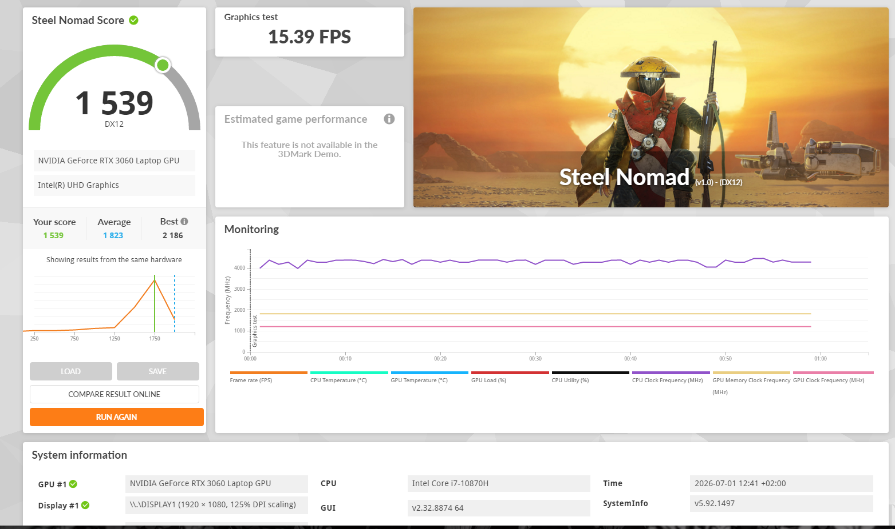

# RTX 30-Series Mobile GPU: Permanent P8/210MHz Lock on Newer NVIDIA Drivers

## TL;DR

A cross-vendor, cross-OS bug affecting RTX 3000-series (and reportedly newer) mobile GPUs: after updating past a certain NVIDIA driver version, the GPU permanently locks into the lowest performance state (P8, ~210MHz core / ~405MHz memory) and never boosts under load. The embedded controller (EC) simultaneously reports wildly incorrect power/current telemetry, which the newer driver reads and reacts to by capping clocks as a protective measure. Reverting to an older driver (e.g. 461.92) restores normal boost behavior, at the cost of losing access to newer CUDA versions.

**Update: a working, confirmed software workaround was found for this case** — see "Confirmed Workaround" below. It does not fix the root cause, but it recovers most of the lost performance while staying on a modern driver with full CUDA support.

## Affected Hardware (confirmed across sources)

- Dell G15 5510 (Intel i7-10870H + RTX 3060 Laptop, 6GB) — this case
- MSI laptops (model unspecified in source thread, RTX 3060)
- Acer Nitro 5 (RTX 3060)
- ASUS ROG (model unspecified)
- Medion Erazer Deputy P25 (AMD Ryzen 7 5800H + RTX 3060)

Spans both Intel and AMD CPU platforms, and at least four OEMs, all sharing NVIDIA RTX 30-series mobile GPUs. This points to the common factor being the **NVIDIA driver's power-state transition logic**, not any single OEM's board design — though each OEM's EC implementation determines exactly how badly it manifests.

## Symptom Signature

- Graphics clock frozen at exactly 210MHz (sometimes reported alongside 405MHz or 840MHz memory/video clock, depending on GPU)
- GPU utilization can read 99-100% while clock stays locked — the workload is real, the GPU just won't boost
- Power/current telemetry is internally inconsistent with reality:
  - On working drivers: power reading can freeze at an implausibly low flat value (e.g. 6.1W) while clock and utilization visibly vary — a dead telemetry channel, not a real cap
  - On broken drivers: power reading spikes to 700-800W (physically impossible for these parts), current readings on individual rails freeze at high values (e.g. 22-33A per rail)
  - "Power Limit" flag in monitoring tools (HWInfo/HWMonitor) shows active (1) continuously on broken drivers
  - The Power Limit (%) control in MSI Afterburner is greyed out/unavailable on the affected unit, regardless of driver
- GPU temperature stays low (40-50°C) — this is *not* thermal throttling
- Can appear immediately on driver install, or only after the GPU attempts to transition out of P8 under stress (varies by how far past the breaking driver version you are)
- PCIe link can also degrade (seen dropping to Gen1 2.5GT/s with recoverable link errors in this case)

## Root Cause (working theory, not confirmed by NVIDIA or any OEM)

Somewhere after driver ~461.92, NVIDIA changed how the driver queries/validates OEM EC power telemetry during P-state transitions (plausibly tied to Dynamic Boost 2.0 / NVIDIA Platform Controller Firmware (NVPCF) interface changes introduced around this era — unconfirmed, offered as the most plausible mechanism). Older drivers either don't perform this query or tolerate bad data silently. Newer drivers treat implausible EC readings as a real overcurrent/overpower condition and defensively cap the GPU at its lowest P-state as a protective measure, and on some units never recover from that state.

Confirmed ruled out on this unit: AWCC (service stopped/disabled, no change), Windows-install corruption (reproduced identically on Linux), stuck volatile EC state (full power-drain reset performed, no change), thermal throttling (temps stay low while locked). This points to a genuine hardware-level defect, most likely in the GPU's power telemetry circuit (e.g. a current-sense IC on the VRM), that only newer drivers act upon.

## Confirmed Workaround: MSI Afterburner Core Clock Offset

**Result: recovers the GPU from a dead 210MHz lock to a stable 1207MHz on driver 610.62 — a ~5.7x improvement, confirmed stable under sustained real load.**

### Setup
1. Open MSI Afterburner (already handles GPUs where NVIDIA Control Panel may not be available)
2. Under **Clock → Core (MHz)**, click the numeric field and type **1000**, press Enter
3. Click **Apply**
4. Save as a profile, then in **Settings (gear icon) → General**, enable **"Apply overclocking at system startup"** so it survives reboots — without this, the GPU reverts to the 210MHz lock on every restart

### Notes and limitations
- The **Power Limit (%)** slider is greyed out entirely on this unit — vBIOS-level restriction, unrelated to the P8 bug, could not be adjusted
- The simple Core (MHz) offset field **hard-caps at +1000** — typing a higher value (tried 1400) has no effect, it clamps back to 1000
- Actual delivered clock (1207MHz) is noticeably below this chip's normal stock boost range (~1400-1700MHz depending on TGP configuration) — this is a partial recovery, not a full fix

### Validation performed
- **3DMark Steel Nomad benchmark**: GPU clock held perfectly flat at ~1200MHz for the entire benchmark run (no reverting to 210MHz under real sustained load) — confirms the fix is stable, not just an idle-screen reading
  - Score: 1539 vs. same-hardware average of 1823 (~84%) and best of 2186 (~70%) — roughly a 15-16% performance deficit vs. typical same-model laptops, consistent with running at ~80-85% of this chip's normal boost clock
  - Note the pink "GPU Clock Frequency (MHz)" trace in the monitoring graph below staying perfectly flat for the full run — this is the stability confirmation, not just the final score

  
- **eFootball real-world test**: performance was identical or better compared to the original 461.92 baseline. This confirms the original diagnosis (see timeline below) that eFootball's FPS inconsistency was CPU-bound, not GPU-clock-bound — the GPU lock/fix has little to no effect on that specific game either way

## Curve Editor Experiments (attempted, not recommended — documented as negative results)

After the simple offset worked, further attempts were made in Afterburner's Voltage/Frequency Curve Editor to push past 1207MHz toward this chip's normal ~1600-1700MHz boost range. These were **unsuccessful and inconsistent**, and are documented here so nobody repeats the same dead ends:

- The curve editor renders two lines: a **bold/dashed interactive curve** (the actual editable V/F table, confirmed by direct testing — only this one responds to clicks/drags) and a **thin non-interactive reference line** underneath it (does not respond to clicks or drag attempts at all)
- **Attempt 1**: flattened the low-voltage section (700-950mV) of the bold curve to a fixed 2300MHz. Result: **worse** — actual delivered clock dropped to ~1000MHz, lower than the simple offset's 1207MHz
- **Attempt 2**: shifted the entire bold curve uniformly upward by +50MHz. Result: **no change at all** — actual delivered clock remained exactly 1207MHz
- **Conclusion**: actual delivered clock does not scale predictably, linearly, or even monotonically with the configured V/F curve on this unit. The broken telemetry/P-state logic appears to override or ignore the curve in ways that don't respond to straightforward tuning, and can react worse to an artificially flattened curve shape than to the offset-shifted default shape. **Recommendation: use the simple Core (MHz) offset slider (+1000) instead of manual curve editing** — it's the only method that has produced a reproducible, stable result.

## This Case: Full Diagnostic Timeline (Dell G15 5510)

System: Dell G15 5510, i7-10870H, RTX 3060 Laptop 6GB, BIOS 1.38.0 (2025/11), Windows 11 Pro.

1. Baseline complaint: inconsistent FPS in eFootball on driver 461.92, locked to this driver because it's the only one that doesn't force the GPU into permanent P8
2. HWMonitor on 461.92: GPU clock ranges 522-1425MHz normally, utilization moves 14-40%, but GPU Power reads a frozen flat 6.10W throughout — identified as a dead telemetry channel, not a real power cap
3. Installed driver 610 (latest at time of testing): GPU clock frozen at 210MHz, "Power Limit" = 1 constantly, current readings frozen at implausible values, PCIe degraded to Gen1 with 61 recoverable errors
4. Stopped + disabled AWCCService entirely, retested — no change
5. NVCleanstall with only Display Driver + PhysX components — no change
6. Full EC power-drain reset — no change
7. Cross-OS test on Linux with a modern driver — **same lock behavior reproduced**, ruling out Windows/registry/AWCC-stack corruption
8. Root cause conclusion: EC-to-driver power telemetry communication broken at a level that survives OS reinstall, AWCC removal, and EC reset — most likely a hardware defect in the GPU power telemetry circuit. No warranty remaining; no local repair shop capable of board-level diagnosis
9. **MSI Afterburner +1000 Core Clock offset applied on driver 610.62 — GPU recovered to a stable 1207MHz.** Confirmed stable via 3DMark Steel Nomad (clock held flat under full load) and real-world eFootball testing (no regression vs. 461.92 baseline)
10. Further curve editor tuning attempted to push past 1207MHz — inconsistent/regressive results, abandoned in favor of the simple offset (see "Curve Editor Experiments" above)

## Ruled Out

| Cause | Status | How it was ruled out |
|---|---|---|
| AWCC / Alienware Command Center | Ruled out | Service stopped + disabled, issue persisted |
| Windows install corruption | Ruled out | Reproduced identically on Linux |
| Stuck volatile EC state | Ruled out | Full power-drain reset performed, no change |
| Thermal throttling | Ruled out | GPU temps stay low (40-50°C range) while locked |
| Specific AWCC version (5.x vs older) | Untested | No older AWCC installer available to test |
| BIOS version | Partially ruled out | Already on latest (1.38.0); Dell blocks downgrades on many G-series models |
| Manual V/F curve tuning beyond +1000 offset | Ruled out as unproductive | Flattening gave worse results; uniform shift gave no change (see Curve Editor Experiments) |
| NVIDIA Profile Inspector (P-State override at driver profile level) | Ruled out | Tried previously (prior to this write-up); did not resolve the lock |
| MSI Afterburner OC Scanner | Ruled out | Fails immediately with "Failed to start scanning!" — most likely because OC Scanner requires trustworthy real-time power/voltage telemetry to iteratively test points, which this unit cannot provide (consistent with the root cause) |

## Untested — Worth Trying Next

With the simple +1000 offset confirmed as a stable baseline (1207MHz), these are the next avenues to try for pushing higher, roughly in order of promise:

1. ~~NVIDIA Profile Inspector~~ — already tried prior to this write-up, did not resolve the lock. Ruled out (see table above).
2. ~~MSI Afterburner's OC Scanner~~ — fails immediately with "Failed to start scanning!". Ruled out (see table above).
3. **The dedicated Core (mV) voltage slider** in the main Afterburner window (separate from the curve editor, never tried) — a different control path than both the offset slider and the curve editor.
4. **Test the same +1000 offset trick on intermediate driver versions** (e.g. 472.12, 516.94, 522.25) rather than only on 610.62 — the offset was only validated on the latest driver; a "less broken" intermediate version might respond differently (better or worse) to the same offset.
5. **NVIDIA Control Panel → Prefer Maximum Performance**, on whichever driver actually exposes Control Panel.
6. **Extended power drain**: 15-20s hold + 15-20 minutes fully unplugged (longer than the version already tried).
7. **Toggle Hybrid vs. Discrete-only GPU mode in BIOS**, if available — one community report found their fix only worked in Hybrid mode.
8. **Disable the wired Ethernet adapter** — reported as an incidental fix in one community thread, mechanism unknown, costs nothing to test.
9. **GPU VBIOS reflash** — last resort, real risk, only reported to give temporary relief in community sources.

## Practical Fallback

With the +1000 offset workaround in place, this is now less critical, but still worth knowing: on 461.92 (no offset needed, GPU boosts normally), the **Vulkan compute backend** (supported by llama.cpp, Ollama, LM Studio) gets full GPU utilization for local LLM inference without touching CUDA at all — a fallback if the workaround ever stops being reliable on a future driver.

## Sources

- [MSI Global English Forum — "GPU stuck at 210 MHz"](https://forum-en.msi.com/index.php?threads/gpu-stuck-at-210-mhz.388801/)
- [Tom's Hardware — "GPU on 100% but GPU stuck on 210 mhz"](https://forums.tomshardware.com/threads/gpu-on-100-but-gpu-stuck-on-210-mhz.3803947/)
- [Tom's Hardware — "GPU clock stuck at 210 MHz"](https://forums.tomshardware.com/threads/gpu-clock-stuck-at-210-mhz.3777250/)
- [Tom's Hardware — "My laptop's RTX 3060 is stuck on 210MHz core speed?"](https://forums.tomshardware.com/threads/my-laptops-rtx-3060-is-stuck-on-210mhz-core-speed.3800963/)
- [NVIDIA GeForce Forums — "(LAPTOP) gpu stuck at 210 mhz core clock and 405 mhz"](https://www.nvidia.com/en-us/geforce/forums/geforce-laptops/6/497370/laptop-gpu-stuck-at-210-mhz-core-clock-and-405-mhz/)
- [NVIDIA GeForce Forums — "Laptop GPU stuck at 210 mhz core clock and 405 mhz" (game-ready-drivers board)](https://www.nvidia.com/en-us/geforce/forums/game-ready-drivers/13/511232/laptop-gpu-stuck-at-210-mhz-core-clock-and-405-mhz/)
- [Medion Community — "RTX 3060 stuck at 210 MHz GPU clock on Medion Erazer Deputy P25"](https://community.medion.com/t5/Notebook-Netbook/RTX-3060-stuck-at-210-MHz-GPU-clock-on-Medion-Erazer-Deputy-P25/td-p/185705)
- [ASUS ROG Forum — "GPU clock speed stuck at 210mhz After Re-Install Windows"](https://rog-forum.asus.com/t5/gaming-notebooks/gpu-clock-speed-stuck-at-210mhz-after-re-install-windows-rog/td-p/1124779)
- [Linus Tech Tips — "Gpu clock and watt is getting stuck at 210mhz and 22W"](https://linustechtips.com/topic/1501430-gpu-clock-and-watt-is-getting-stuck-at-210mhz-and-22w-and-not-using-full-power-but-running-at-99-utilization/)
